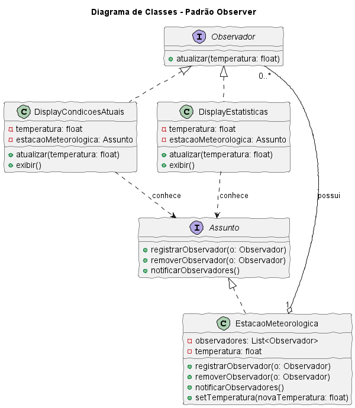

# [🔗 Acesse a Aula Interativa](./index.html)  

##

# Padrão Observer em Java

Este projeto demonstra a implementação do padrão de design comportamental **Observer** em Java. O padrão define uma dependência de um para muitos entre objetos, garantindo que quando um objeto (o assunto) muda de estado, todos os seus dependentes (os observadores) são notificados e atualizados automaticamente.

## Estrutura do Projeto

O código Java está organizado nas seguintes interfaces e classes:

* `Observador.java`: Interface que define o contrato para os objetos que querem ser notificados.
* `Assunto.java`: Interface que define o contrato para o objeto que gerencia e notifica seus observadores.
* `EstacaoMeteorologica.java`: A implementação concreta do `Assunto`.
* `DisplayCondicoesAtuais.java`: Uma implementação concreta do `Observador`, que exibe a temperatura atual.
* `DisplayEstatisticas.java`: Outra implementação concreta do `Observador`, que exibe estatísticas sobre a temperatura.
* `SimuladorEstacaoMeteorologica.java`: A classe principal que simula o uso do padrão.

## Diagrama de Classes

A seguir, o diagrama de classes que ilustra a estrutura do padrão Observer implementado neste projeto:

